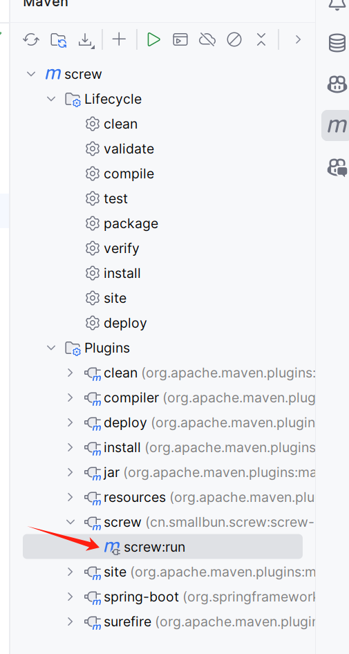

```xml
<!-- 配置数据库连接信息 -->
<configuration>
    <!-- 用户名 -->
    <username>username</username>
    
    <!-- 密码 -->
    <password>password</password>
    
    <!-- 驱动类名 -->
    <driverClassName>driverClassName</driverClassName>
    
    <!-- JDBC URL -->
    <jdbcUrl>jdbcUrl</jdbcUrl>

    <!-- 生成文件类型 -->
    <fileType>WORD/HTML/MARKDOWN</fileType>
    
    <!-- 打开文件输出目录 -->
    <openOutputDir>false</openOutputDir>
    
    <!-- 生成模板 -->
    <produceType>freemarker</produceType>
    
    <!-- 描述 -->
    <description>数据库文档生成</description>
    
    <!-- 版本 -->
    <version>${project.version}</version>
    
    <!-- 标题 -->
    <title>fire数据库文档</title>
    
    
</configuration>
``` 

pom文件夹中根据自己的数据库选择相应的文本复制到pom.xml        
配置数据库连接信息           
        
启动即可生成数据库文档     
